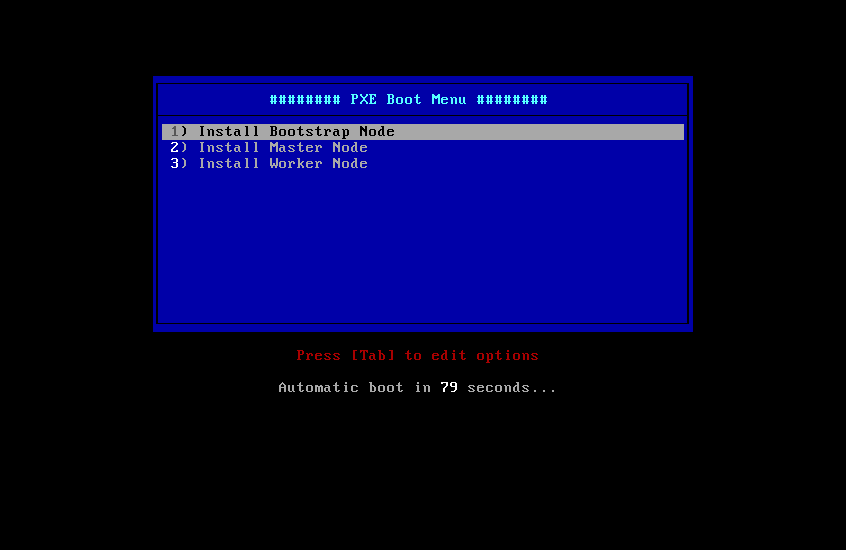

# Helper Node Quickstart Install

This quickstart will get you up and running on `libvirt`. This should work on other environments (i.e. Virtualbox); you just have to figure out how to do the virtual network on your own.

> **NOTE** If you want to use static ips follow [this guide](qs-static.md)

To start login to your virtualization server / hypervisor

```
ssh virt0.example.com
```

And create a working directory

```
mkdir ~/ocp4-workingdir
cd ~/ocp4-workingdir
```

## Create Virtual Network

Download the virtual network configuration file, [virt-net.xml](./virt-net.xml)

```
wget https://raw.githubusercontent.com/christianh814/ocp4-upi-helpernode/master/virt-net.xml
```

Create a virtual network using this file file provided in this repo (modify if you need to).

```
virsh net-define --file virt-net.xml
```

Make sure you set it to autostart on boot

```
virsh net-autostart openshift4
virsh net-start openshift4
```

## Create a CentOS 7 VM

Download the [Kickstart file](helper-ks.cfg) for the helper node.

```
wget https://raw.githubusercontent.com/christianh814/ocp4-upi-helpernode/master/helper-ks.cfg
```

Edit `helper-ks.cfg` for your environment and use it to install the helper. The following command installs it "unattended".

> **NOTE** Change the path to the ISO for your environment

```
virt-install --name="ocp4-aHelper" --vcpus=2 --ram=4096 \
--disk path=/var/lib/libvirt/images/ocp4-aHelper.qcow2,bus=virtio,size=30 \
--os-variant centos7.0 --network network=openshift4,model=virtio \
--boot menu=on --location /var/lib/libvirt/ISO/CentOS-7-x86_64-Minimal-1810.iso \
--initrd-inject helper-ks.cfg --extra-args "inst.ks=file:/helper-ks.cfg" --noautoconsole
```

The provided Kickstart file installs the helper with the following settings (which is based on the [virt-net.xml](./virt-net.xml) file that was used before).

* IP - 192.168.7.77
* NetMask - 255.255.255.0
* Default Gateway - 192.168.7.1
* DNS Server - 8.8.8.8

You can watch the progress by lauching the viewer

```
virt-viewer --domain-name ocp4-aHelper
```

Once it's done, it'll shut off...turn it on with the following command

```
virsh start ocp4-aHelper
```

## Create "empty" VMs

Create (but do NOT install) 6 empty VMs. Please follow the [min requirements](https://docs.openshift.com/container-platform/4.1/installing/installing_bare_metal/installing-bare-metal.html#minimum-resource-requirements_installing-bare-metal) for these VMs. 

> Make sure you attached these to the `openshift4` network!

__Masters__

Create the master VMs

```
for i in master{0..2}
do 
  virt-install --name="ocp4-${i}" --vcpus=4 --ram=12288 \
  --disk path=/var/lib/libvirt/images/ocp4-${i}.qcow2,bus=virtio,size=120 \
  --os-variant rhel8.0 --network network=openshift4,model=virtio \
  --boot menu=on --print-xml > ocp4-$i.xml
  virsh define --file ocp4-$i.xml
done
```

__Workers and Bootstrap__

Create the bootstrap and worker VMs

```
for i in worker{0..1} bootstrap
do 
  virt-install --name="ocp4-${i}" --vcpus=4 --ram=8192 \
  --disk path=/var/lib/libvirt/images/ocp4-${i}.qcow2,bus=virtio,size=120 \
  --os-variant rhel8.0 --network network=openshift4,model=virtio \
  --boot menu=on --print-xml > ocp4-$i.xml
  virsh define --file ocp4-$i.xml
done
```

## Prepare the Helper Node

After the helper node is installed; login to it

```
ssh root@192.168.7.77
```

Install `ansible` and `git` and clone this repo

```
yum -y install ansible git
git clone https://github.com/christianh814/ocp4-upi-helpernode
cd ocp4-upi-helpernode
```

Edit the [vars.yaml](./vars.yaml) file with the mac addresses of the "blank" VMs. Get the Mac addresses with this command

```
for i in bootstrap master{0..2} worker{0..1}
do
  echo -ne "${i}\t" ; virsh dumpxml ocp4-${i} | grep "mac address" | cut -d\' -f2
done
```

## Run the playbook

Run the playbook to setup your helper node

```
ansible-playbook -e @vars.yaml tasks/main.yml
```

After it is done run the following to get info about your environment and some install help


```
/usr/local/bin/checker.sh
```

## Create Ignition Configs

Now you can start the installation process. Create an install dir.

```
mkdir ~/ocp4
cd ~/ocp4
```

Next, create an `install-config.yaml` file

```
cat <<EOF > install-config.yaml
apiVersion: v1
baseDomain: example.com
compute:
- hyperthreading: Enabled
  name: worker
  replicas: 0
controlPlane:
  hyperthreading: Enabled
  name: master
  replicas: 3
metadata:
  name: ocp4
networking:
  clusterNetworks:
  - cidr: 10.254.0.0/16
    hostPrefix: 24
  networkType: OpenShiftSDN
  serviceNetwork:
  - 172.30.0.0/16
platform:
  none: {}
pullSecret: '{"auths": ...}'
sshKey: 'ssh-ed25519 AAAA...'
EOF
```

Visit [try.openshift.com](https://cloud.redhat.com/openshift/install) and select "Bare Metal". Then copy the pull secret. Replace `pullSecret` with that pull secret and `sshKey` with your ssh public key.

Next, generate the ignition configs

```
openshift-install create ignition-configs
```

Finally, copy the ignition files in the `ignition` directory for the websever

```
cp ~/ocp4/*.ign /var/www/html/ignition/
restorecon -vR /var/www/html/
```

## Install VMs

Launch `virt-manager`, and boot the VMs into the boot menu; and select PXE. You'll be presented with the following picture.



Boot/install the VMs in the following order

* Bootstrap
* Masters
* Workers

On your laptop/workstation visit the status page 

```
firefox http://192.168.7.77:9000
```

You'll see the bootstrap turn "green" and then the masters turn "green", then the bootstrap turn "red". This is your indication that you can continue.

## Wait for install

The boostrap VM actually does the install for you; you can track it with the following command.

```
openshift-install wait-for bootstrap-complete --log-level debug
```

Once you see this message below...

```
DEBUG OpenShift Installer v4.1.0-201905212232-dirty 
DEBUG Built from commit 71d8978039726046929729ad15302973e3da18ce 
INFO Waiting up to 30m0s for the Kubernetes API at https://api.ocp4.example.com:6443... 
INFO API v1.13.4+838b4fa up                       
INFO Waiting up to 30m0s for bootstrapping to complete... 
DEBUG Bootstrap status: complete                   
INFO It is now safe to remove the bootstrap resources
```

...you can continue....at this point you can delete the bootstrap server.

## Finish Install

First, login to your cluster

```
export KUBECONFIG=/root/ocp4/auth/kubeconfig
```

Set up storage for you registry (to use PVs follow [this](https://docs.openshift.com/container-platform/4.1/installing/installing_bare_metal/installing-bare-metal.html#registry-configuring-storage-baremetal_installing-bare-metal)

```
oc patch configs.imageregistry.operator.openshift.io cluster --type merge --patch '{"spec":{"storage":{"emptyDir":{}}}}'
```

> Note: You can watch the operators running with `oc get clusteroperators`

Watch your CSRs. These can take some time; go get come coffee or grab some lunch. You'll see your nodes' CSRs in "Pending" (unless they were "auto approved", if so, you can jump to the `wait-for install-complete` step)

```
watch oc get csr
```

To approve them all in one shot...

```
oc get csr -ojson | jq -r '.items[] | select(.status == {} ) | .metadata.name' | xargs oc adm certificate approve
```

Check for the approval status (it should say "Approved,Issued")

```
oc get csr | grep 'system:node'
```

Once Approved; finish up the install process

```
openshift-install wait-for install-complete 
```

## DONE

Your install should be done! You're a UPI master!
